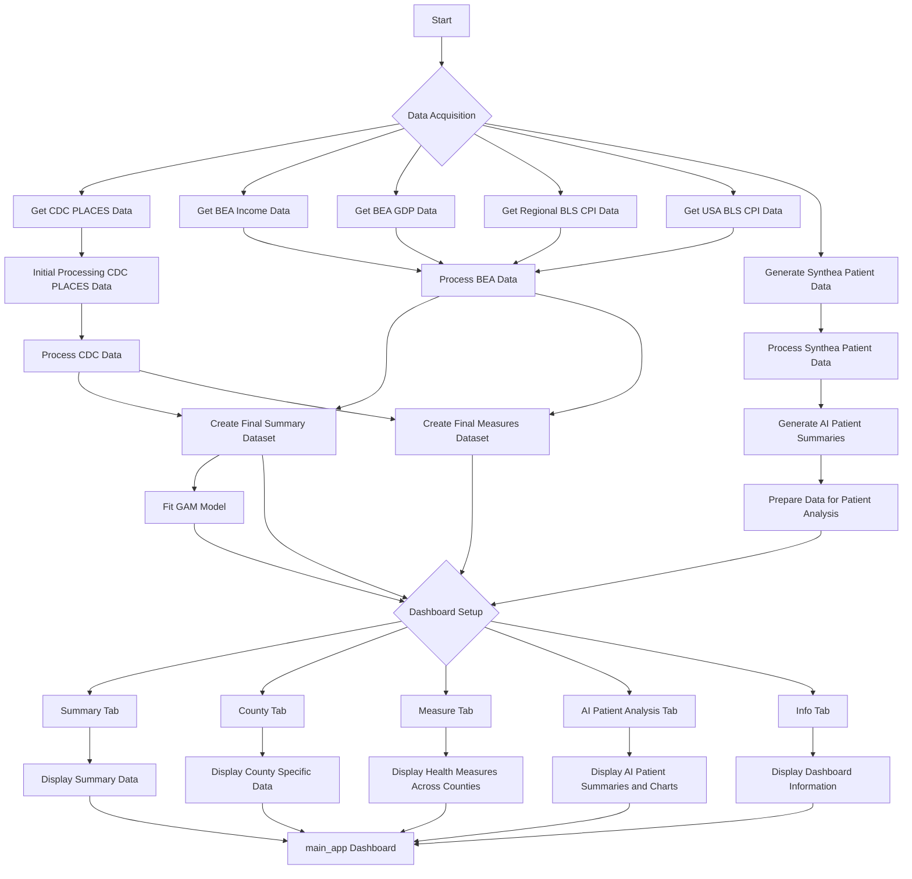

# <a href="https://unhealth-dashboard-6d75504325c4.herokuapp.com/" target="_blank">The UnHealth Dashboard</a>

**Developed by**: <a href="https://sloughje.github.io/" target="_blank">JS Data Science Services LLC</a>

## Dashboard Overview

The Dashboard aims to deliver insights into U.S. county health by combining CDC health metrics, BEA economic data, BLS CPI data, and Census geolocation data. At its core is the UnHealth Score™, designed to assess county health comprehensively. This score aggregates various health indicators, facilitating direct county comparisons and highlighting areas needing health interventions.

The dashboard now includes an AI Patient Analysis tab, leveraging AI to generate personalized patient health summaries and visualize vital health data, enriching the decision-making process for healthcare providers.

### Tab Information

#### Summary 

- **Interactive Map**: Shows UnHealth scores across counties, color-coded from healthier (green) to less healthy (red).
- **Scatter Plot**: Illustrates the relationship between per capita income and UnHealth Scores, identifying economic-health patterns.
- **Table of Rankings**: Lists counties with the best and worst health scores, income per capita, and population.

#### County

Focuses on a selected county’s details, offering in-depth analysis through interactive charts and key performance indicators (KPIs). Features include county selection, health score and economic KPIs display, an interactive map, health metrics chart, and economic trends charts.

#### Health Measures

Explores specific health measures across counties, featuring an interactive map for visualizing the distribution of health metrics, measure selection functionality, and a table listing the best and worst scores for the selected health measure.

#### AI Patient Analysis

Generates AI summaries of individual patient health, integrating Synthea patient data with public health metrics for a comprehensive health overview. This view also includes interactive charts for vitals, lab results, and Quality of Life Scores (QOLS), providing actionable insights for healthcare professionals.

# Dashboard Data Processing Workflow

## Overview

This outlines the steps taken to process data for our dashboard, which uses health metrics from CDC PLACES and economic indicators from the Bureau of Economic Analysis (BEA) and inflation data from the Bureau of Labor Statistics (BLS).

## Processing Steps

### CDC PLACES Health Data

1. **Getting Data**: We download CDC PLACES data for 2022 and 2023 directly from the CDC API for the latest health metrics.
2. **Merging Data**: We combine data from different years into one dataset for analysis.
3. **Filling Gaps**: For missing disability data in Florida, we use U.S. averages to keep our dataset complete.
4. **Using Maps**: We add geographical data from U.S. census to help visualize health metrics on maps.
5. **Adjusting Metrics**: We flip certain health measures to keep consistency across all data. We also prioritize health metrics based on their impact on community health.
6. **Ranking**: We rank counties based on health metrics after normalizing their values for fair comparison.
7. **Summary**: We calculate and summarize the health status of counties, focusing on key health metrics.

### Economic Data from BEA and Inflation Data from BLS

1. **Economic Data Fetching**: We pull income and GDP data for counties, states, and the nation from BEA, and inflation trends from BLS.
2. **Organizing Data**: We organize this data into usable formats, making sure we capture all necessary details.
3. **Combining and Cleaning**: We merge different datasets, clean them up, and prepare them for analysis, ensuring geographic identifiers match up where needed.
4. **Inflation Adjustment**: We adjust economic figures for inflation using CPI data, making sure we're comparing real values over time.

### Final Dataset Creation

1. **Matching FIPS Codes**: We check and match FIPS codes across health and economic datasets, correcting any discrepancies.
2. **Creating Datasets**: We make two summary datasets:
   - One combines health rankings with economic data for a complete view of each county.
   - The other details health measures by county, providing insights into specific health outcomes and behaviors.
3. **Adjustments and Notes**: We adjust data for inflation and add notes to clarify any changes or data sources used.

The final datasets are structured and saved for use in our dashboard, providing a comprehensive view of health and economic conditions across the U.S. This workflow ensures our dashboard offers up-to-date and accurate information for analysis.

### AI Patient Summary Data

Utilizes synthetic patient data and AI to generate personalized health summaries. This involves selecting pertinent patient information, integrating public health context including the UnHealth Score, and applying AI to create insightful summaries for individual patient care.

# Project Flow Diagram

